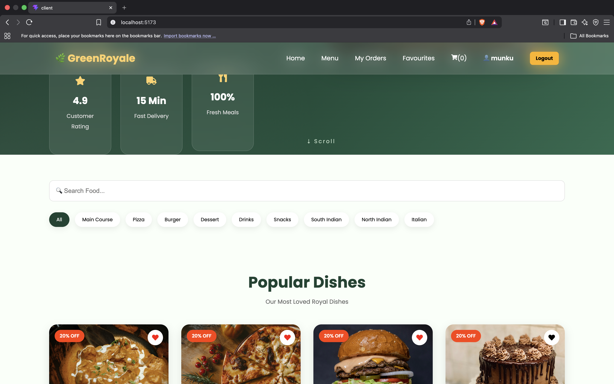
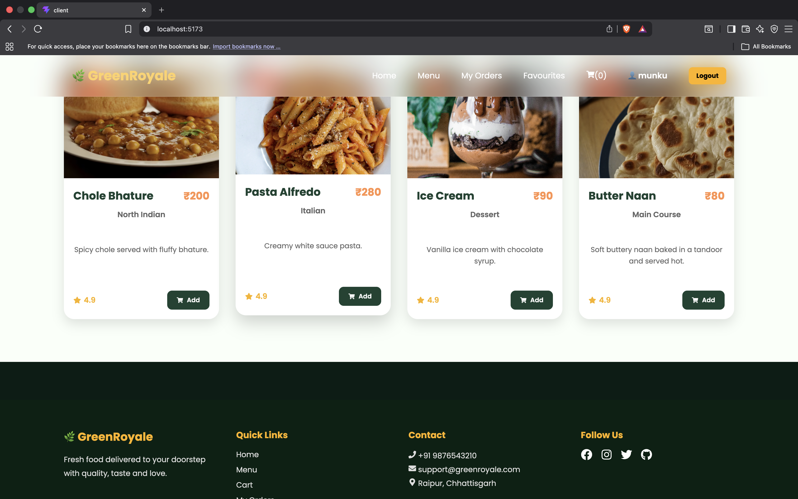
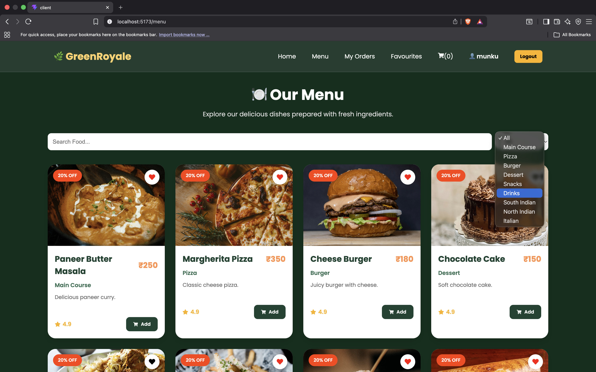
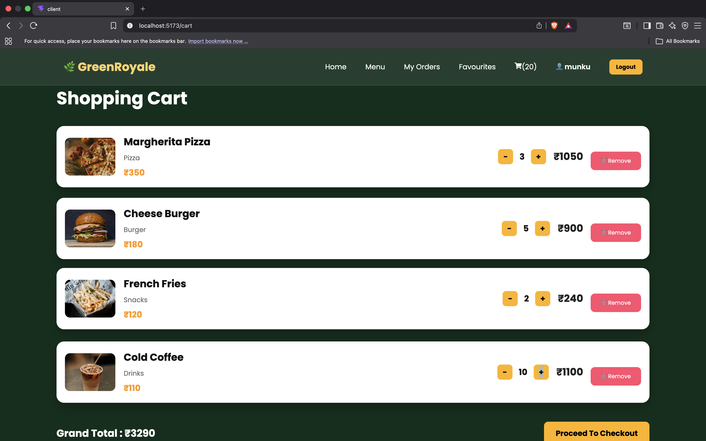
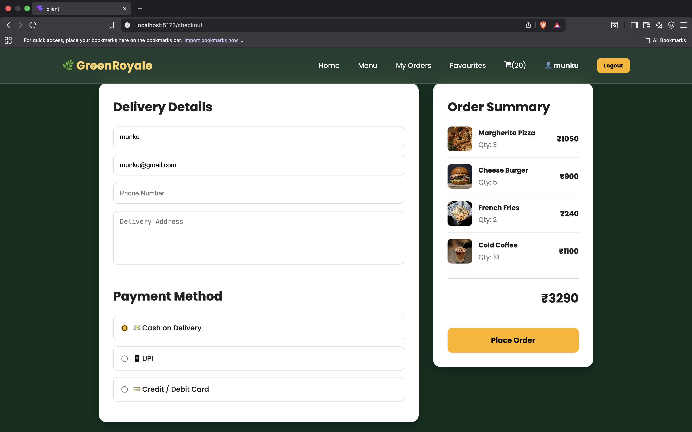
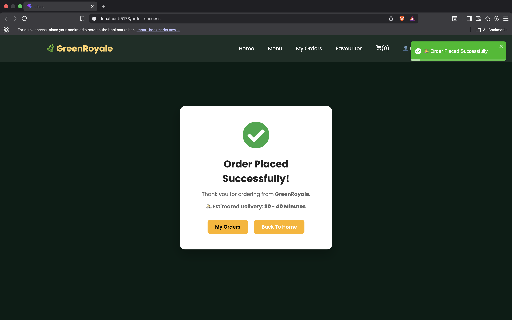
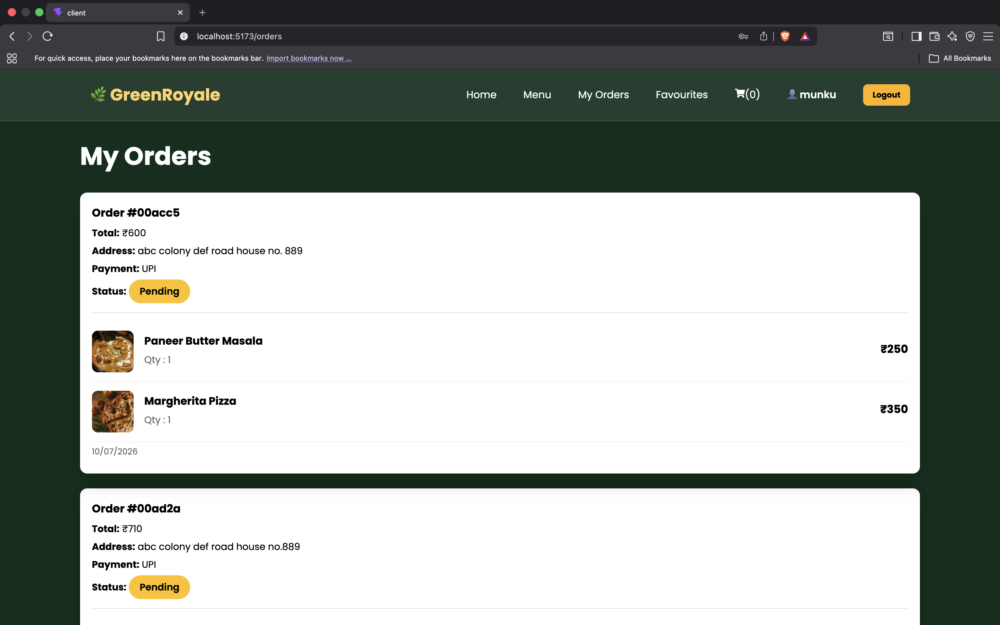
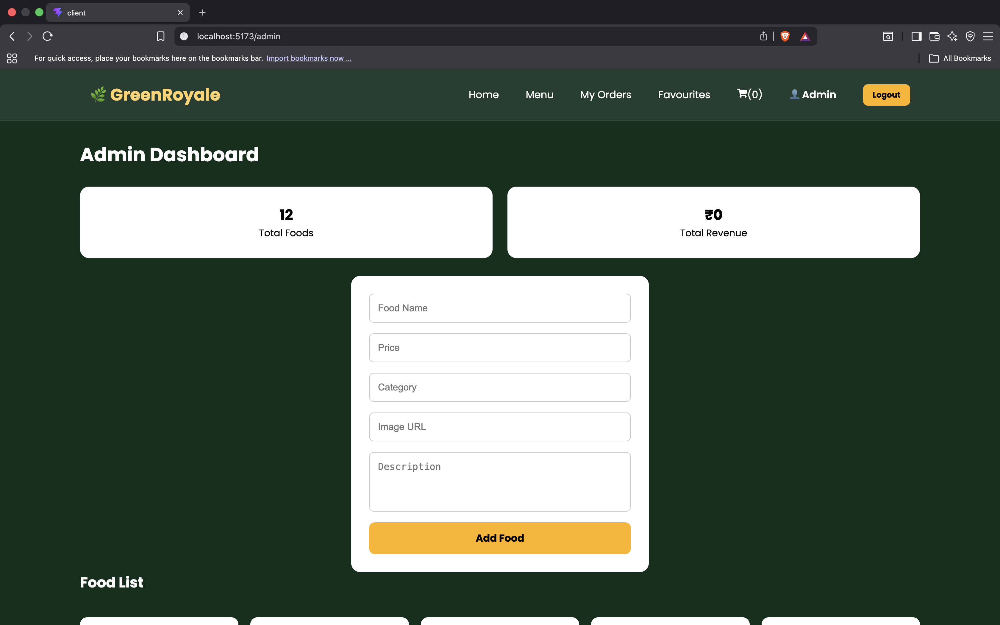
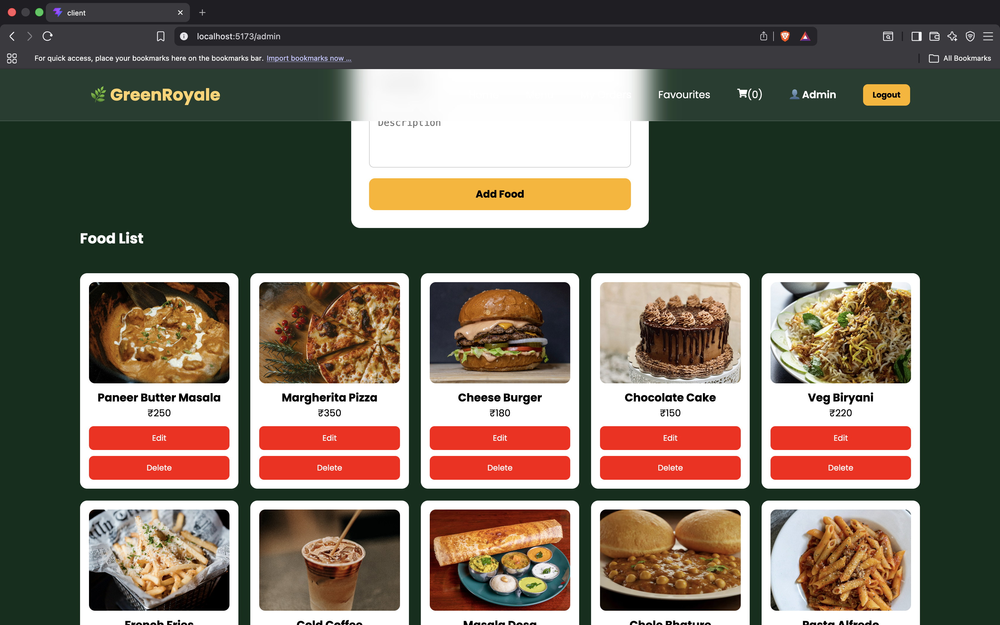

# 🍽️ GreenRoyale - MERN Food Ordering Website

A modern full-stack Food Ordering Web Application built using the **MERN Stack (MongoDB, Express.js, React.js, Node.js)**. GreenRoyale provides a smooth and user-friendly experience for browsing food items, managing favourites, placing orders, and tracking order history. It also includes an Admin Panel for efficient food and order management.

---

## 🚀 Features

### 👤 User Module
- User Registration & Login
- JWT Authentication
- Protected Routes
- Persistent Login

### 🍽️ Food Module
- Browse Food Menu
- Search Food
- Category Filter
- Responsive Food Cards

### ❤️ Favourite Module
- Add to Favourite
- Remove from Favourite
- Dedicated Favourite Page

### 🛒 Cart Module
- Add to Cart
- Increase / Decrease Quantity
- Remove Items
- Grand Total Calculation

### 💳 Checkout Module
- Delivery Details
- Payment Method Selection
  - Cash on Delivery
  - UPI
  - Credit / Debit Card
- Order Summary
- Order Success Page

### 📦 Orders Module
- My Orders
- Order Status
- Payment Method Display

### 🛠️ Admin Module
- Admin Login
- Add Food
- Update Food
- Delete Food
- View All Orders
- Update Order Status

---

# 🛠 Tech Stack

## Frontend
- React.js
- React Router DOM
- Axios
- React Toastify
- CSS3

## Backend
- Node.js
- Express.js
- JWT Authentication
- bcrypt.js

## Database
- MongoDB Atlas
- Mongoose

---

# 📂 Project Structure

```text
GreenRoyale/
│
├── client/
│   ├── components/
│   ├── pages/
│   ├── services/
│   ├── context/
│   ├── assets/
│   └── App.jsx
│
├── server/
│   ├── controllers/
│   ├── middleware/
│   ├── models/
│   ├── routes/
│   ├── config/
│   └── server.js
│
├── README.md
└── package.json
```

---

# ⚙️ Installation

### Clone Repository

```bash
git clone https://github.com/YOUR_USERNAME/GreenRoyale.git
```

### Install Frontend

```bash
cd client
npm install
```

### Install Backend

```bash
cd ../server
npm install
```

---

# ▶️ Run Project

### Start Backend

```bash
cd server
npm run dev
```

### Start Frontend

```bash
cd client
npm run dev
```

---

# 🔐 Environment Variables

Create a `.env` file inside the **server** folder.

```env
PORT=5001

MONGO_URI=your_mongodb_connection_string

JWT_SECRET=your_jwt_secret
```

> ⚠️ Never upload your real `.env` file to GitHub.

---

# 📸 Screenshots

### 🏠 Home Page





### 🍔 Menu Page



### ❤️ Favourite Page


### 🛒 Cart Page



### 💳 Checkout Page



### ✅ Order Success



---

### 📦 My Orders



### 👨‍💼 Admin Dashboard




---

# 🎯 Future Enhancements

- Online Payment Gateway Integration
- Live Order Tracking
- Email Notifications
- User Profile Management
- Ratings & Reviews
- Coupon & Discount System

---

# 👥 Team Members

- **Mayank Shrivastava** *(Team Leader)*
- Member 2
- Member 3
- Member 4

---

# 📜 License

This project is developed for **educational and learning purposes**.

---

# ⭐ Support

If you found this project useful, consider giving it a ⭐ on GitHub.